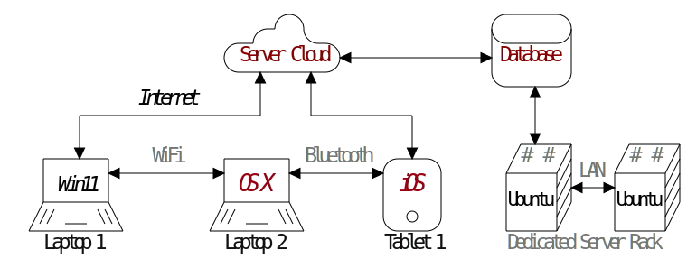
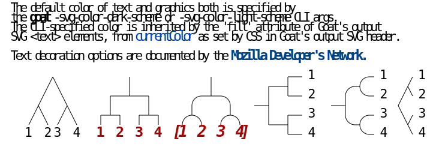
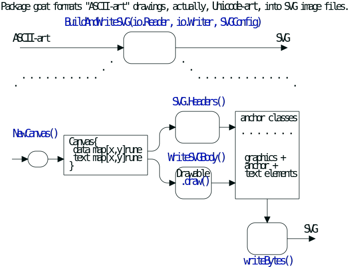

# GoAT: Go ASCII Tool

<!-- Github-specific status icons-->


## What **GoAT** Can Do For You

- With the [`goat`](#installation) CLI command, transform chunky ASCII-art source
to graphically-rich [SVG](#icons).

  For high-level documentation of software,
  1. Embed ASCII-art diagrams in comments adjacent to the source code.
  2. Extract each ASCII-art block to an individual file with any simple text filtering tool.
  3. Pass each file through `goat`.
  5. Assemble high-level documentation in Markdown, incorporating the SVG files by
     reference or by copying.

  Your ASCII-art source persists as the single-point-of-truth, revision-controlled
  in lock-step with the code that embeds it.

  The two common cases of generating full HTML, or Markdown only, as required by
  GitHub, must be handled somewhat differently.

#### Markdown for GitHub and similar servers
For reasons including security and branding consistency, services such
as GitHub do their own rendering of Markdown to HTML.
A regression-test cycle of Markdown for GitHub therefore cannot be completed locally,
but  must include review of the result as it appears on GitHub.
A local "proofing" step can quickly catch problems, but
 cannot exactly replicate GitHub's presentation of your Markdown and Goat-generated SVG.

To reduce the number of full-upload cycles, you may want to automate proofing of your
Markdown and SVG locally, similarly to our example [`script here`](markdown_to_html.sh).

The steps are:
  1. `Goat` generates SVG files, from either of source code extractions or
     standalone TXT files.
  2. Generate HTML with a Markdown processer and CSS styling that approximate GitHub's,
     incorporating the SVG either by reference from `` elements, or
     a direct file inclusion preprocessing step.
  3. Examine HTML output in local browser e.g. by opening as `file:///tmp/proof/MyDoc.html`

#### Bare HTML production, such as for first-party servers.
Incorporate a Goat-to-SVG phase into your existing HTML production cycle,
drawing your Goat diagram source from either bare files, or extracted comments source code.

## You Will Also Need

#### Graphical- or Rectangle-oriented text editing capability
Both **vim** and **emacs** offer useful support.
In Emacs, see the built-in rectangle-editing commands, and ```picture-mode```.

#### A fixed-pitch font with 2:1 height:width ratio as presented by your editor and terminal emulator
Most fixed-pitch or "monospace" Unicode fonts maintain a 2:1 aspect ratio for
characters in the ASCII range,
and all characters with meaning for GoAT's graphics output are ASCII.
However, certain Unicode graphical characters e.g. MIDDLE DOT may be useful in text strings,
provided they conform to the standard width of the ASCII range in your source-editing font.
These may be freely used in text strings of your source diagrams.

CJK characters on the other hand are typically wider than 2:1.
Non-standard width characters are not in general composable on the left-right axis within a plain-text
drawing, because the remainder of the line of text to their right is pushed out of alignment
with rows above and below.

### Anchor-Wrapping: GoAT's Approach to Text Styling

GoAT Version 2 allows any contiguous range of character in the ASCII-art source to be
styled in HTML according to a specified set of *HTML attributes* and *CSS properties*.
Each range is marked out by a pair of author-selected *anchor key* characters. 
The anchor key pair selects one line from an accompanying table, itself
containing HTML attribute and CSS property key-value definition pairs; these
are bound by `GoAT` to a generated HTML anchor element itself containing HTML text elements:

    <a ... ><text>T</text>... </a>

The attributes and properties act on the text elements by inheritance from the enclosing anchor.
See usage examples below for further detail.

### Web links from text not available
Note that Github "
[sanitizes](https://github.github.com/gfm/#what-is-github-flavored-markdown-)
" uploaded Markdown, and directly embedded ```<svg>``` elements are not allowed.
For this reason, this web page includes SVG by way of references to files through
`````` elements.
Within such an `````` indirection, ```href``` attributes within ```<a>``` elements are disabled.
Therefore, the 'href="https://..."' snippets you see below
do not produce clickable links within the accompanying SVG output.

See also [pkg.go.dev](https://pkg.go.dev/github.com/blampe/goat).

### Installation
```
    $ go install github.com/blampe/goat/cmd/goat@latest
```
<!-- https://docs.github.com/en/get-started/writing-on-github/working-with-advanced-formatting/organizing-information-with-collapsed-sections#creating-a-collapsed-section -->

---

## Examples

Here are some snippets of
GoAT-formatted UTF-8
and the SVG each can generate
The first example demonstrates the versatility of anchor-wrapped text.
See below for simpler examples.

### Icons
##### TXT
```
                                      .-.                           .--------.
                                   .-+   |                         |          |
                               .--+       '--.                     |'--------'|
                              | ‘Server Cloud’|<------------------>|‘Database’|
                               '-------------'                     |          |
                                   ^      ^                         '--------'
                  “Internet”       |      |                              ^
          .------------------------'      '-------------.                |
          |                                             |                v
          v                                             v              .------.       .------.
     .--------.     ₉WiFi     .--------.  Bluetooth  .-----.          / #  # /|      / #  # /|
     |        |<------------->|        |<---------->|       |        +------+/| LAN⁹+------+/|
“    |  Win11 |               | ₅OS X⁵ |            | ₅iOS⁵ |        |      +/|<--->|      +/|
”    +--------+               +--------+            |       |        |Ubuntu+/|     |Ubuntu+/|
    /// ____ \\\             /// ____ \\\           |   o   |        |      +/      |      +/
   '------------'           '------------'           '-----'         '------'       '------'
     ₈Laptop 1                 Laptop 2              Tablet 1⁸       ₉Dedicated Server Rack⁹

#‘’   fill:#800 -- fill:#F40  # N.B. ¹-³ are at code points 0xB0-0xB3
#“”   style="font-style:oblique"
#₅⁵   fill:#901 style="text-decoration:underline;" href='https://apple.com' -- fill:#C04
#₈⁸   fill:#111 text-decoration:underline href='https://developer.mozilla.org/en-US/docs/Web/CSS/color_value#currentcolor_keyword' -- fill:#EEE
#₉⁹   fill:#777 -- fill:#999  # N.B. ⁰ and ⁴-⁹ are at code points 0x2070 and 0x2074-0x2079

```
##### SVG


### Trees
##### TXT
```
  The default color of text and graphics both is specified by
  the«goat»₇svg-color-dark-scheme⁷or ₇svg-color-light-scheme⁷CLI args.
  The CLI-specified color is inherited by the 'fill' attribute of Goat's output
  SVG <text> elements, from₆currentColor⁶as set by CSS in Goat's output SVG header.

  Text decoration options are documented by the₄Mozilla Developer's Network⁴

          .               .                .               .--- 1          .-- 1     / 1
         / \              |                |           .---+            .-+         +
        /   \         .---+---.         .--+--.        |   '--- 2      |   '-- 2   / \ 2
       +     +        |       |        |       |    ---+            ---+          +
      / \   / \     .-+-.   .-+-.     .+.     .+.      |   .--- 3      |   .-- 3   \ / 3
     /   \ /   \    |   |   |   |    |   |   |   |     '---+            '-+         +
     1   2 3   4  { 1   2   3   4   [1   2   3   4] }      '--- 4          '-- 4     \ 4


#{}   fill:#A00 href="https://github.com" font-weight:bold -- fill:#FCC
#«»   style="font-weight:bold"
#₄⁴ . fill:#048 font-weight:bold text-decoration:underline href='https://developer.mozilla.org/en-US/docs/Learn/CSS/Styling_text/Fundamentals#font_style_font_weight_text_transform_and_text_decoration' -- fill:#0CF
#₆⁶   fill:#04F style="text-decoration:underline;" href='https://developer.mozilla.org/en-US/docs/Web/CSS/color_value#currentcolor_keyword' -- fill:#0CF
#₇⁷-  fill:currentColor text-decoration:underline href='https://developer.mozilla.org/en-US/docs/Web/CSS/color-scheme'
#[][] font-style:oblique
#\\\\\\
# \\\\\\
#  \\\\\`--- SPACE in column 6
#   \\\\`--- text replacement for closing anchor key (in column 3)
#    \\\`--- text replacement for opening anchor key (in column 2)
#     \\`--- closing key for anchor wrapping                     
#      \`--- opening key for anchor wrapping                     
#       `--- '#' in column 1

```
##### SVG
The SVG graphics below were read from a file linked to by inline Markdown image references
([howto](https://docs.github.com/en/get-started/writing-on-github/getting-started-with-writing-and-formatting-on-github/basic-writing-and-formatting-syntax#images),
[spec](https://github.github.com/gfm/#images)) from
GoAT's [README.md](README.md), then finally rendered to HTML `````` elements by Github's Markdown processor



### Overlaps -- mid-range color value
##### TXT
```

           .-.           .-.           .-.           .-.           .-.           .-.
          |   |         |   |         |   |         |   |         |   |         |   |
       .---------.   .--+---+--.   .--+---+--.   .--|   |--.   .--+   +--.   .------|--.
      |           | |           | |   |   |   | |   |   |   | |           | |   |   |   |
       '---------'   '--+---+--'   '--+---+--'   '--|   |--'   '--+   +--'   '--|------'
          |   |         |   |         |   |         |   |         |   |         |   |
           '-'           '-'           '-'           '-'           '-'           '-'

```
##### SVG
Setting a foreground color in the middle of the possible range of value or luminance
is one way to work around a limitation of certain browsers e.g. Safari.
Safari does not support inheritance of
the [`color-scheme`](https://developer.mozilla.org/en-US/docs/Web/CSS/@media/prefers-color-scheme)
CSS property by
`goat`'s output `<svg>` element
from within an enclosing `` element such as are generated by Markdown.


### Line Decorations
##### TXT
```
                ________                            o        *          *   .--------------.
   *---+--.    |        |     o   o      |         ^          \        /   |  .----------.  |
       |   |    '--*   -+-    |   |      v        /            \      /    | |  <------.  | |
       |    '----->       .---(---'  --->*<---   /      .+->*<--o----'     | |          | | |
   <--'  ^  ^             |   |                 |      | |  ^    \         |  '--------'  | |
          \/        *-----'   o     |<----->|   '-----'  |__|     v         '------------'  |
          /\                                                               *---------------'

```
##### SVG


### Line Ends
##### TXT
```
   o--o    *--o     /  /   *  o  o o o o   * * * *   o o o o   * * * *      o o o o   * * * *
   o--*    *--*    v  v   ^  ^   | | | |   | | | |    \ \ \ \   \ \ \ \    / / / /   / / / /
   o-->    *-->   *  o   /  /    o * v '   o * v '     o * v \   o * v \  o * v /   o * v /
   o---    *---
                                 ^ ^ ^ ^   . . . .   ^ ^ ^ ^   \ \ \ \      ^ ^ ^ ^   / / / /
   |  |   *  o  \  \   *  o      | | | |   | | | |    \ \ \ \   \ \ \ \    / / / /   / / / /
   v  v   ^  ^   v  v   ^  ^     o * v '   o * v '     o * v \   o * v \  o * v /   o * v /
   *  o   |  |    *  o   \  \

   <--o   <--*   <-->   <---      ---o   ---*   --->   ----      *<--   o<--   -->o   -->*


```
##### SVG


### Dot Grids
##### TXT
```

  o o o o o  * * * * *  * * o o *    o o o      * * *      o o o     · * · · ·     · · ·
  o o o o o  * * * * *  o o o o *   o o o o    * * * *    * o * *    · * * · ·    · · · ·
  o o o o o  * * * * *  o * o o o  o o o o o  * * * * *  o o o o o   · o · · o   · · * * ·
  o o o o o  * * * * *  o * o o o   o o o o    * * * *    o * o o    · · · · o    · · * ·
  o o o o o  * * * * *  * * * * o    o o o      * * *      o * o     · · · · ·     · · *


```
Note that '·' above is not ASCII, but rather Unicode, the MIDDLE DOT character, encoded with UTF-8.


### Large Nodes
##### TXT
```

   .---.       .-.        .-.       .-.                                       .-.
   | A +----->| 1 +<---->| 2 |<----+ 4 +------------------.                  | 8 |
   '---'       '-'        '+'       '-'                    |                  '-'
                           |         ^                     |                   ^
                           v         |                     v                   |
                          .-.      .-+-.        .-.      .-+-.      .-.       .+.       .---.
                         | 3 +---->| B |<----->| 5 +---->| C +---->| 6 +---->| 7 |<---->| D |
                          '-'      '---'        '-'      '---'      '-'       '-'       '---'

```
##### SVG


### Small Grids
##### TXT
```
       ___     ___      .---+---+---+---+---.     .---+---+---+---.  .---.   .---.   .---. .---.    .-.   .-.  0
   ___/   \___/   \     |   |   |   |   |   |    / \ / \ / \ / \ /   |   +---+   |   | A | | B |   | A | | B | 1
  /   \___/   \___/     +---+---+---+---+---+   +---+---+---+---+    +---+   +---+   '---' '---'    '-'   '-'  2
  \___/ b \___/   \     |   |   | b |   |   |    \ / \a/ \b/ \ / \   |   +---+   |   .---. .---.    .-.   .-.  3
  / a \___/   \___/     +---+---+---+---+---+     +---+---+---+---+  +---+ b +---+   | C | | D |   | C | | D | 4
  \___/   \___/   \     |   | a |   |   |   |    / \ / \ / \ / \ /   | a +---+   |   '---' '---'    '-'   '-'  5
      \___/   \___/     '---+---+---+---+---'   '---+---+---+---'    '---'   '---'   0123456789012345678901234 6


```
##### SVG


### Big Grid
##### TXT
```
    .----.        .----.
   /      \      /      \            .-----+-----+-----.
  +        +----+        +----.      |     |     |     |          .-----+-----+-----+-----+
   \      /      \      /      \     |     |     |     |         /     /     /     /     /
    +----+   B    +----+        +    +-----+-----+-----+        +-----+-----+-----+-----+
   /      \      /      \      /     |     |     |     |       /     /     /     /     /
  +   A    +----+        +----+      |     |  B  |     |      +-----+-----+-----+-----+
   \      /      \      /      \     +-----+-----+-----+     /     /  A  /  B  /     /
    '----+        +----+        +    |     |     |     |    +-----+-----+-----+-----+
          \      /      \      /     |  A  |     |     |   /     /     /     /     /
           '----'        '----'      '-----+-----+-----'  '-----+-----+-----+-----+


```
##### SVG


### Complicated
##### TXT
```
+-------------------+                           ^                      .---.
|    A Box          |__.--.__    __.-->         |      .-.             |   |
|                   |        '--'               v     | * |<---        |   |
+-------------------+                                  '-'             |   |
                       Round                                       *---(-. |
  .-----------------.  .-------.    .----------.         .-------.     | | |
 |   Mixed Rounded  | |         |  / Diagonals  \        |   |   |     | | |
 | & Square Corners |  '--. .--'  /              \       |---+---|     '-)-'       .--------.
 '--+------------+-'  .--. |     '-------+--------'      |   |   |       |        / Search /
    |            |   |    | '---.        |               '-------'       |       '-+------'
    |<---------->|   |    |      |       v                Interior                 |     ^
    '           <---'      '----'   .-----------.              ---.     .---       v     |
 .------------------.  Diag line    | .-------. +---.              \   /           .     |
 |   if (a > b)     +---.      .--->| |       | |    | Curved line  \ /           / \    |
 |   obj->fcn()     |    \    /     | '-------' |<--'                +           /   \   |
 '------------------'     '--'      '--+--------'      .--. .--.     |  .-.     +Done?+-'
    .---+-----.                        |   ^           |\ | | /|  .--+ |   |     \   /
    |   |     | Join        \|/        |   | Curved    | \| |/ | |    \    |      \ /
    |   |     +---->  o    --o--        '-'  Vertical  '--' '--'  '--  '--'        +  .---.
 <--+---+-----'       |     /|\                                                    |  | 3 |
                      v                             not:line    'quotes'        .-'   '---'
  .-.             .---+--------.            /            A || B   *bold*       |        ^
 |   |           |   Not a dot  |      <---+---<--    A dash--is not a line    v        |
  '-'             '---------+--'          /           Nor/is this.            ---


    colored      inherited style          bold      inherited          italic

```
##### SVG
The UTF-8 encodings above for Unicode characters 'SUBSCRIPT ZERO' through
'SUBSCRIPT NINE' request a specific
one (of up to ten) user-defined CSS text styles be applied to following
SVG <text> elements.


### More examples are [here](examples)

---

## The GoAT Library

The core engine of ```goat``` is accessible as a Go library package, for inclusion in specialized
code of your own.
The code implements a subset, and some extensions, of the
ASCII diagram generation function of the
browser-side Javascript in [Markdeep](http://casual-effects.com/markdeep/).

A nicely formatted reference may be found
at [pkg.go.dev](https://pkg.go.dev/github.com/blampe/goat).

### Installation
```
    $ go get -u github.com/blampe/goat/
```
### Library Data Flow


The diagram above was derived by [./make.sh](./make.sh) from ASCII-art in the Go
source file [./goat.go](./goat.go).

#### Auto-formatted API docs

<!--
 XX XX  May need a Github Action to do this substitution at "push" time.
[](https://pkg.go.dev/github.com/blampe/goat)
-->

<!--
 The scraping of GitHub by godocs.io (see https://sr.ht) does NOT include README.md;
 whereas Google's pkg.go.dev does do so, and apparently runs its own variant of GFM processing :-/ 
[](https://godocs.io/github.com/blampe/goat)
-->

### Project Tenets

1. Utility and ease of integration into existing projects are paramount.
2. Compatibility with MarkDeep desired, but not required.
3. TXT and SVG intelligibility are co-equal in priority.
4. Composability of TXT not to be sacrificed -- only width-8 characters allowed.
5. Per-platform support limited to a single widely-available fixed-pitch TXT font.
6. Light/Dark [color scheme](https://developer.mozilla.org/en-US/docs/Web/CSS/color-scheme) fully supported.

[@bep]: https://github.com/bep/goat/
[@dmacvicar]: https://github.com/dmacvicar/goat
[@sw46]: https://github.com/sw46/goat/
[SVG]: https://en.wikipedia.org/wiki/Scalable_Vector_Graphics
[markdeep.mini.js]: http://casual-effects.com/markdeep/
[v0.93.0]: https://github.com/gohugoio/hugo/releases/tag/v0.93.0
